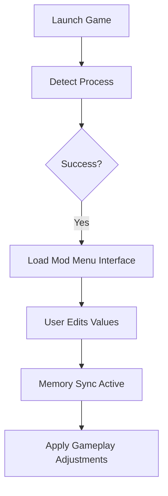

# The Farmer Was Replaced Mod Menu – Smart Farming & Automation Editor 🤖

Enter the world of synthetic farming with full command over your systems.
The **The Farmer Was Replaced Mod Menu** is an all-in-one overlay for **live automation tuning**, **resource balancing**, and **visual configuration**, built for creators, testers, and players who love optimizing every gear of their robotic homestead.

It’s **safe**, **session-based**, and designed for **complete control** — giving you the tools to personalize your farm without affecting your game files.

---

## ⚙️ Overview

This mod menu works as a **real-time overlay** with modular components for bots, crops, energy, and player physics.
No permanent edits, no injection instability — just adaptive memory mapping that updates as you play.

---

## 🌾 Core Features

### ⚡ Automation Systems

* Modify **robot behavior trees** (task priorities, idle time, loop count).
* Enable **Instant Task Completion** for debugging routines.
* Adjust **energy consumption**, **charging rate**, and **efficiency curves**.
* Toggle **infinite power grid** for creative sandbox play.

### 🌱 Growth & Production

* Control **crop growth speed**, **harvest intervals**, and **output rates**.
* Activate **auto-replant** or **auto-harvest** for test environments.
* Manage **soil fertility multipliers** and **weather response curves**.

### 🧠 AI & World Behavior

* Fine-tune **bot logic delay**, **collision radius**, and **task selection range**.
* Pause or slow **world time** for design analysis.
* Spawn or despawn resources dynamically for layout balancing.

### 🌈 Visual & Debug Tools

* Enable **overlay heatmap** to visualize task paths and idle zones.
* Toggle **UI performance graphs**, **AI node links**, and **resource flow maps**.
* Adjust **FOV**, **camera smoothing**, and **lighting tint** for creative capture.

[!NOTE]
All parameters are reset after you close the game — ensuring a **zero-risk sandbox experience**.

---

## 🖥 Compatibility

| Platform                | Build Version    | Mode                | Status            |
| ----------------------- | ---------------- | ------------------- | ----------------- |
| **Windows 11**          | v1.04+           | Single Player       | ✅ Fully Supported |
| **Windows 10**          | v1.03+           | Sandbox Mode        | ✅ Stable          |
| **Controller Support**  | Xbox / DualSense | ✅ Optional          |                   |
| **Multiplayer / Cloud** | ❌                | Disabled for safety |                   |

[!IMPORTANT]
Always launch the Mod Menu **after** the game loads into the main farm scene for best stability.

---

## ⚡ Setup Guide

1. **Download and extract** `FarmerWasReplaced_ModMenu.zip`.
2. Run `FarmOverlay.exe` as Administrator.
3. Launch **The Farmer Was Replaced** and wait for connection confirmation.
4. Press `Insert` to open the in-game overlay.
5. Toggle modules or edit sliders in real time.

Example configuration:

```ini
[Automation]
InstantTasks=True
BotSpeedMultiplier=2.0
EnergyUsage=0.4
ChargeRate=1.5

[Growth]
CropSpeed=4.0
AutoReplant=True
HarvestBonus=3
WeatherEffect=Reduced

[World]
Gravity=0.85
TimeScale=0.5
LightingIntensity=1.1
```

[!WARNING]
Avoid enabling **InstantTasks** with **TimeScale < 0.5** — it may desync animation cycles on slower CPUs.

---

## 🧩 System Flow Diagram



---

## ❓ FAQ

**Q1: Does this alter save data or unlock achievements?**
No. All changes exist only during runtime; once closed, everything resets.

**Q2: Can I adjust robot parameters while they’re active?**
Yes. The overlay updates bots in real time without reloading.

**Q3: Will it lower FPS?**
No noticeable drop — memory sync runs under 1% CPU usage.

**Q4: Is it multiplayer safe?**
No — the menu is for **local and sandbox testing** only.

**Q5: Can I create custom presets?**
Yes, store them in `/presets/` for one-click swaps between playstyles.

---

## 🧠 Advanced Tips

* Use **AI Heatmap Mode** to visualize robot idle paths for efficiency tuning.
* Combine **EnergyUsage 0.5** with **ChargeRate 2.0** for endless automation chains.
* Adjust **CropSpeed** and **TimeScale** together for cinematic time-lapse sequences.
* Save separate presets for **Creative**, **QA Testing**, and **Survival Balance**.

[!NOTE]
For photo or recording sessions, enable **World Freeze** + **Free Camera** to capture your farm in perfect stillness.

---

## 🌻 Final Thoughts

The **The Farmer Was Replaced Mod Menu** is the definitive sandbox toolkit for automation enthusiasts.
From robot balance to environmental fine-tuning, it gives you the power to test, create, and refine your robotic farm — all while keeping your saves safe and your experience stable.

